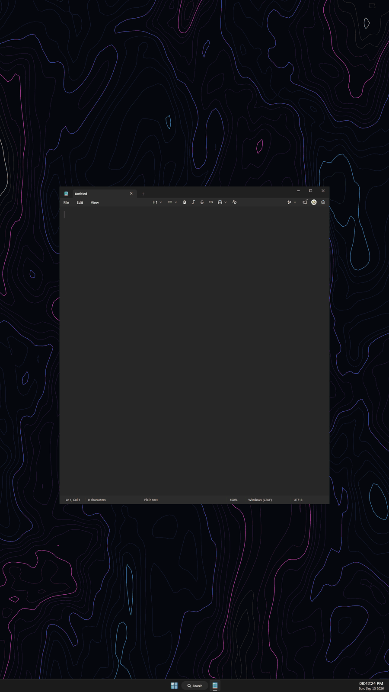
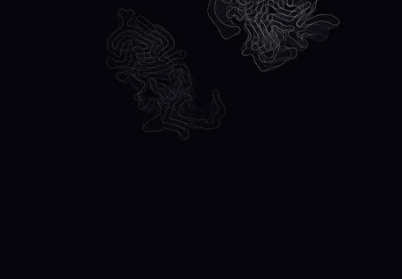
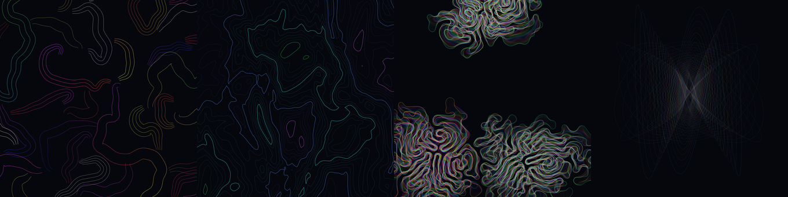

# Vector Screen Holder

A [Windhawk](https://windhawk.net) mod that fills a display with generative
line art and holds the screen awake while it runs. It runs on your primary
display, on any single display you name, on all of them at once, or on all but
the one you work on.

Every frame is stroked geometry through Direct2D. There are no images, no video
file and no fixed resolution, so the art is drawn for whatever size the display
you pick actually is: a 1080p side monitor and a 4K portrait panel each get
correctly proportioned output.

Downloading a large file, or running a long build, render or backup, and you
need the machine not to sign you out or drop to idle? Start the Screen Holder,
put it on a side monitor next to your task monitor, and go to lunch.

## Controls

| Input | What it does |
| --- | --- |
| **Esc** | Close the overlay, once it has focus, or from anywhere with **Global Esc** on |
| **Left click** | Cycle to the next enabled style |
| **Right click** | Step the amount (how much information is on screen) |
| **Mouse wheel** | Adjust the current style's parameter |
| **Space** | Step to the next palette, once the overlay has focus |
| **Ctrl+Alt+H** | Toggle the overlay (configurable) |

Change anything and a single line appears along the bottom naming the style,
its value, the amount notch and the palette, then fades after about two
seconds. It is the only text the mod draws, and only your own input raises it:
the rotation timer changes style in silence.

The overlay sits above your wallpaper but *below* your windows: anything you
open covers it normally, it never steals focus by itself, and it stays out of
Alt+Tab.

It does cover the desktop icons on the display it runs on, and by default a
click there lands on the overlay rather than the desktop. Turn on **Click
through to the desktop** and every click passes to the desktop instead, so the
icons keep working with the art drawn over them. The trade is that the overlay
takes no input at all in that mode: the hotkey shows and hides it, and **Global
Esc** closes it.

## The four styles

Left to right: **flow field**, **contours**, **differential growth**,
**harmonograph**. Each has a parameter on the wheel and an amount on right
click.

| Style | Parameter (wheel) | Amount (right click) |
| --- | --- | --- |
| Flow field | field turbulence | ribbon packing density |
| Contours | terrain relief | 6 to 46 iso levels |
| Differential growth | colony vigor | 1 to 6 colonies |
| Harmonograph | draw tempo | 1 to 6 overlaid figures |

## Installing

This is a single-file Windhawk mod. Open Windhawk, create a new mod, paste the
contents of [`vector-screen-holder.wh.cpp`](vector-screen-holder.wh.cpp), and
compile.

It runs as a Windhawk *tool mod* in its own dedicated `windhawk.exe` process, so
it is never injected into your applications.

## Keeping the PC awake

While the overlay is up the mod calls `SetThreadExecutionState` with
`ES_CONTINUOUS | ES_SYSTEM_REQUIRED | ES_DISPLAY_REQUIRED`, cleared the moment
it closes. It does **not** synthesise input, so tools that track real input
rather than display state (Teams, Slack) will still mark you away.

## Prototype

The four algorithms were developed in a browser bench before being ported to
Direct2D. [`prototype/`](prototype/) holds it. Open `proto.html` over HTTP (not
`file://`) and each panel runs one algorithm with live controls. The C++ scenes
mirror it closely, so it is still the fastest place to try a change to the art.

## Algorithm references

The generative techniques are well-trodden ground; these are the clearest
public implementations of each:

- **Flow field**: [moistkitteh/Flowfield_Generative_Art](https://github.com/moistkitteh/Flowfield_Generative_Art), itself after Tyler Hobbs' *Fidenza*
- **Contours**: [arthurxavierx/contour-lines](https://github.com/arthurxavierx/contour-lines) by Arthur Xavier
- **Differential growth**: [inconvergent/differential-line](https://github.com/inconvergent/differential-line) by inconvergent
- **Harmonograph**: [Paul Bourke's harmonograph notes](https://paulbourke.net/geometry/harmonograph/)

## The readout font

The status line is set in [Fusion Pixel Font](https://github.com/TakWolf/fusion-pixel-font)
by [TakWolf](https://takwolf.com), under the SIL Open Font License 1.1. The mod
carries a 717 glyph subset of it, covering the Latin, Greek and Cyrillic
alphabets, which is published on its own at
[akilluminati47/fusion-pixel-font](https://github.com/akilluminati47/fusion-pixel-font/releases/tag/vsh-subset-2026.09.01)
along with the script that cuts it.

## Credits

By [akilluminati47](https://akilluminati47.github.io/akilluminati47/), written
with the AI pair-programmers Claude and Big-Pickle (opencode), on the algorithm
and font references above.

## License

MIT, except the embedded font, which is OFL-1.1 as above.
